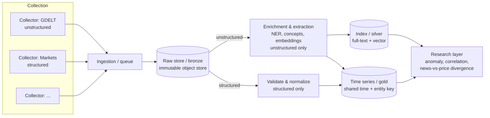

# Bellwether — Real-World Outcome Modeling Platform

> **Name.** "Bellwether" (a leading indicator) reflects the platform's purpose:
> surfacing early signals of change. It's an evolving codebase — the name can
> still change if something better comes along.

| | |
|---|---|
| **Status** | Draft / ideation |
| **Version** | 0.1 |
| **Owner** | Dylan |
| **Last updated** | 2026-05-31 |

---

## 1. Overview

Bellwether is a general-purpose **observational signal pipeline**. It continuously
harvests heterogeneous external data — both **unstructured content** (news, text)
and **structured numerical feeds** (prices, volumes, counts) — converts each into
comparable signals, organizes them onto a shared time axis, and exposes a research
surface for exploratory trend and anomaly detection.

The core value is **alignment**: putting qualitative signals ("what the world is
saying about X") and quantitative signals ("the price of the contract about X")
onto the same time and entity space so they can be compared. Divergence between
the two is itself a signal.

The platform is **domain-agnostic** by design. The motivating first application
is detecting prediction-market events (Kalshi, Polymarket) that show signs of
abnormal or informed trading — but that is one *signal* built on top of a
reusable substrate, not the platform itself.

In short: _watch the world, turn what it says into trackable numbers over time,
and make it cheap to ask "is anything unusual happening here?"_

---

## 2. Motivation

The underlying need keeps recurring across domains: take many noisy, unstructured
sources, distill them into comparable signals, and look for patterns. Solving it
once as a one-off script is easy; solving it as a reusable, replayable platform
is the goal here.

**Why a platform instead of scripts:**

- **Reuse** — the same pipeline serves market-anomaly research, OSINT-style
  monitoring, or any "track concepts over time" question.
- **Replayability** — raw data is kept immutable, so extraction and analysis can
  be re-run later with better models *without re-collecting*.
- **Separation of concerns** — collection, storage, extraction, and research
  evolve independently and fail independently.

**Motivating use case (v1 target):** ingest news and prediction-market data,
track sentiment/coverage/volume per entity over time, and surface events where
market movement diverges from public information flow — a candidate fingerprint
for informed trading. This is detection/research over *public* data, in the
spirit of academic and regulatory market-surveillance work.

---

## 3. Core Concepts

| Term | Definition |
|---|---|
| **Source** | An external origin of data (e.g. GDELT, Kalshi API, an RSS feed). |
| **Collector** | An isolated, scheduled job that pulls from one source and emits raw records. |
| **Raw record** | An immutable, provenance-stamped capture of source data (bronze layer). |
| **Tag / Concept** | A structured signal *extracted* from unstructured content — entity, theme, keyword, sentiment. Open-vocabulary. |
| **Metric** | A structured numerical value arriving already-quantified from a feed (e.g. contract price, traded volume). No extraction needed. |
| **Tracked Symbol** | A canonical, first-class time series with a dedicated key. May originate from a *promoted* tag (news side) **or** a structured metric (market side). |
| **Signal** | A derived metric or score computed over tracked symbols (e.g. coverage volume, tone, price move, news-vs-price divergence). |
| **Experiment** | A reproducible research job that tests a hypothesis against signals/time series. |

The **Tag → Tracked Symbol promotion** distinction is central — see §6.1.

---

## 4. Architecture

Bellwether follows a **medallion** shape: **bronze** (raw/immutable) → **silver**
(cleaned, enriched, indexed) → **gold** (aggregated time series), with a research
layer on top.

Data takes one of **two ingestion paths** depending on its shape, but both land in
the immutable raw store first and both converge in the gold time-series layer on a
**shared time + entity key**:

- **Unstructured content** (news, text) → extraction (NER, themes, tone) → tags → time series.
- **Structured numerical feeds** (prices, volumes) → validate/normalize → time series *directly*, skipping extraction — there is nothing to extract.

**Layers**

1. **Collection** — one isolated, scheduled collector per source. Owns rate
   limits, auth, dedup, idempotency, and provenance. One collector breaking must
   not affect the others.
2. **Ingestion** — a single decoupling entry point (queue/log) so producers can't
   overwhelm downstream, and so the stream is buffered and replayable.
3. **Raw store (bronze)** — immutable, partitioned, append-only, cheap. The
   replayable source of truth. Never mutated.
4. **Enrichment / extraction** (*unstructured path only*) — the unstructured →
   structured step: entity recognition, concept/keyword extraction, embeddings,
   sentiment, and entity resolution. Structured feeds bypass this stage.
4b. **Validate / normalize** (*structured path only*) — schema/type validation,
   unit and timestamp normalization, and keying to a tracked symbol. No NLP.
5. **Index (silver)** — retrieval by keyword, structured field, and vector
   similarity.
6. **Time series (gold)** — both paths converge here, keyed on a **shared time +
   entity space** so qualitative and quantitative series for the same subject can
   be joined and compared.
7. **Research** — batch, exploratory, reproducible experiments over the time
   series and index.
8. **Orchestration** (cross-cutting) — schedules and wires the stages together
   with retries, lineage, and data-quality checks.

**Operator/research surface.** A front end sits on top of the research and gold
layers for humans: viewing and querying records/tags/observations, watching
pipeline health, and reviewing configuration. A **Streamlit web UI** is packaged
with the backend at `src/bellweather/web/` (run `make ui`), today on mock data
behind a swappable data-access seam, so it can be repointed at real read-endpoints
later without rewriting the screens.

---

## 5. Initial Scope & Sequencing

### 5.1 GDELT's role

GDELT is **not the platform** and does not, on its own, deliver the motivating use
case. It plays two specific roles, both on the *unstructured* path:

1. **A source** of one signal type — global news coverage.
2. **Borrowed extraction** — GDELT has already converted articles into structured
   themes, entities, and tone, so v0 gets the unstructured→structured NLP step for
   free instead of building it.

What GDELT does **not** provide is the **structured numerical half** — contract
prices, volumes, order-book data. That comes from market collectors (Kalshi,
Polymarket) on the structured path. The comparison of the two halves is the whole
point, so the price feed is a first-class requirement, not an afterthought.

### 5.2 v0 — prove the spine (GDELT only)

The first milestone is a **thin vertical slice** that proves the plumbing end to
end with a single source. It demonstrates the *architecture*, not yet the *value*.

**What GDELT provides** (verify against current GDELT docs before building — stable
at a high level, but integration details drift):

- Global monitoring of news media across many languages.
- An **Event Database** (coded actor–action–actor events) and a **Global
  Knowledge Graph (GKG)** that extracts themes, people, organizations, locations,
  counts, and tone from articles.
- Frequent update cadence (~15-minute batches) delivered as downloadable files,
  plus query APIs; also mirrored on Google BigQuery.

**v0 slice:**

1. **Collector** polls GDELT on its update cadence and emits raw records.
2. **Ingestion → raw store**: land the files immutably with provenance.
3. **Extraction (borrowed)**: use GDELT's *existing* themes/entities/tone as the
   initial tag space — do **not** build our own NLP yet.
4. **Time series**: aggregate selected tags into per-bucket counts/tone.
5. **Research**: a notebook that plots a tracked symbol's coverage/tone over time
   and flags simple anomalies.

### 5.3 v1 — add the structured feed and the comparison

Add a market collector (e.g. Kalshi) on the **structured path**: validate/normalize
contract prices and volumes into time series keyed to the same entity space, then
extend the research layer to compute **news-vs-price divergence**. This is the
milestone that delivers the actual use case.

> **Open sequencing decision:** v0 (single source, plumbing only) de-risks the
> architecture but shows no value; a dual-source v0 (one news + one price feed)
> demonstrates the comparison sooner at higher initial cost. Pick based on whether
> architecture risk or value-demonstration matters more right now.

---

## 6. Design Tensions & Open Questions

### 6.1 Emergent vocabulary vs. tractable time series

A closed symbol set makes time series trivial; an open vocabulary of extracted
concepts explodes in cardinality and fills with synonyms. Proposed resolution: a
**two-tier model** — extract openly into a raw tag space, run **entity
resolution** to collapse synonyms into canonical entities, then **promote**
high-signal canonical tags into first-class tracked symbols with dedicated time
series. This gives emergence without an unbounded time-series keyspace.

_Open question:_ what's the promotion criterion (manual, frequency threshold,
analyst-driven)?

### 6.2 Multiple comparisons in exploratory research

"Throw many signals at the wall and see what sticks" is p-hacking by
construction — scan enough series and spurious correlations are guaranteed. The
research layer must bake in guardrails from the start: out-of-sample/holdout
validation, false-discovery-rate control, and treating any hit as a hypothesis
to re-test on fresh data, not a finding.

### 6.3 Build vs. reuse

GDELT covers a large fraction of the news pipeline. The standing question for
each new capability: extend a mature external source, or build it in-house?
Default to reuse until a concrete gap forces a build.

### 6.4 Provenance & reproducibility

Every derived signal must trace back to immutable raw records, and extraction
must be re-runnable as models improve. This constrains the raw store to be
append-only and the extraction stage to be idempotent and versioned.

### 6.5 Cross-source entity linking

To compare news against price, a market contract ("Will X happen by date D?") must
be linked to the news entities/themes that concern the same subject. This is the
**join key** that makes the qualitative↔quantitative comparison possible, and it
is distinct from the synonym-collapsing entity resolution in §6.1: here the
challenge is mapping *across* sources and schemas, not merging duplicates within
one. Likely the highest-value and hardest correctness problem in the platform.

_Open question:_ manual contract→entity mapping, or automated linking from contract
text/metadata?

---

## 7. Non-Goals (v0)

- **Not** a low-latency or real-time trading execution system.
- **No** automated trading or any market-acting behavior — research/detection only.
- **Not** a finished ML model; the research layer is an exploration substrate.
- **No** bespoke NLP before the GDELT spine works end-to-end.
- **Not** a multi-source platform on day one — one source, all layers, first.

---

## 8. Candidate Tech (direction, not decision)

All swappable; chosen for "lean but real" and self-hostability.

| Layer | Candidate |
|---|---|
| Collection | Python collectors (httpx / Scrapy where needed) |
| Ingestion | Redpanda / Kafka |
| Raw store | S3 or MinIO + Iceberg/Delta (time travel) |
| Extraction | GDELT's own tags (v0); later spaCy + embeddings |
| Index | OpenSearch and/or a vector DB (Qdrant / pgvector) |
| Time series | ClickHouse (or Druid for high-cardinality slicing) |
| Research | DuckDB + notebooks; Polars; scale out with Spark/Ray later |
| Orchestration | Dagster (asset/lineage-centric) |

---

## 9. Next Steps

- Decompose §4 into ticket-style work items — recommended first epic is the **v0
  GDELT spine** (§5.2) as a single vertical slice.
- Decide the **v0 vs dual-source sequencing** question (§5.3).
- Verify current GDELT data products and API/access details against official docs.
- Decide the tracked-symbol **promotion criterion** (§6.1) and the **cross-source
  linking** approach (§6.5).
